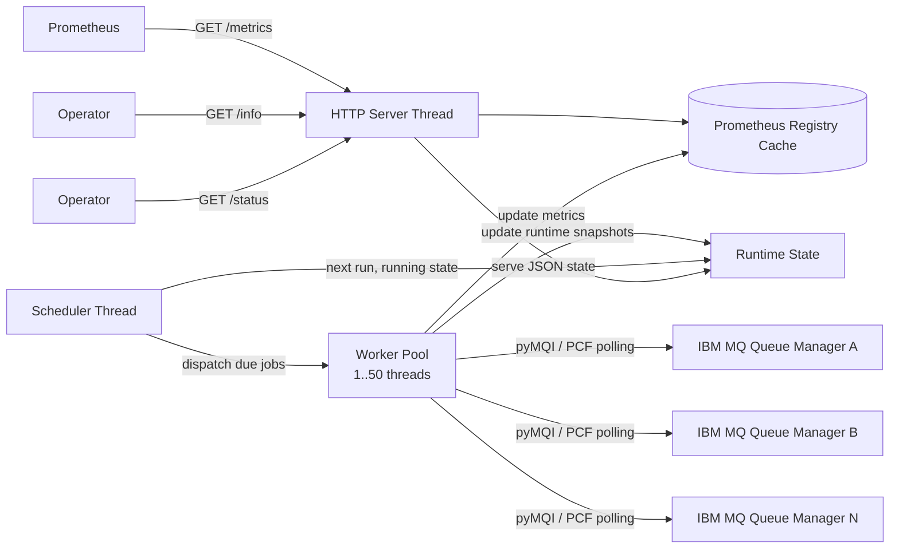

# MQ Prometheus Exporter for Python and pyMQI

Prometheus exporter for IBM MQ, built in Python 3 with `pyMQI`, designed for production-friendly polling behavior instead of scrape-driven remote collection.

[](#getting-started)
[](#metrics-and-endpoints)
[](#overview)

## Table of Contents
- [Overview](#overview)
- [Why This Exporter](#why-this-exporter)
- [Key Capabilities](#key-capabilities)
- [Architecture](#architecture)
- [Getting Started](#getting-started)
- [Configuration Model](#configuration-model)
- [Metrics and Endpoints](#metrics-and-endpoints)
- [Using docker_build for Local MQ Test Environments](#using-docker_build-for-local-mq-test-environments)
- [Running the Exporter](#running-the-exporter)
- [Operational Model](#operational-model)
- [Project Layout](#project-layout)
- [Current Scope and Extension Points](#current-scope-and-extension-points)

## Overview
This exporter is built for a practical IBM MQ monitoring pattern:

- background worker threads poll remote queue managers on their own schedule
- Prometheus scrapes cached metrics only
- HTTP serving is isolated from MQ collection activity
- concurrency is bounded, with a configurable ceiling up to `50` worker threads
- per-queue-manager polling intervals are defined in YAML

That separation matters. A scrape should never be the trigger for remote MQ command execution. In this design, scraping is a read-only operation against an in-memory Prometheus registry.

## Why This Exporter
Many exporter implementations collapse collection and presentation into the same execution path. That is tolerable for cheap local metrics and a bad fit for remote IBM MQ estates.

This exporter is intended for environments where:

- a single process may monitor many remote queue managers
- MQ PCF activity must be rate-controlled
- scrape spikes must not multiply load on MQ
- failures on one queue manager must not stall the HTTP server
- the last known good metrics should remain visible during transient poll failures

## Key Capabilities
- Dedicated HTTP thread for endpoint presentation.
- Independent background scheduler for queue manager polling.
- Bounded worker pool with `max_threads` capped at `50`.
- YAML-driven global and per-queue-manager configuration.
- Stable cached metrics between scrapes.
- Exporter health metrics such as target up/down, poll duration, next poll time, and poll error totals.
- Additional `/info` and `/status` endpoints for operational visibility.

## Architecture


### Control Plane Summary
- The scheduler decides when each queue manager is polled.
- The worker pool performs remote MQ collection.
- The registry cache stores the most recent metric values.
- The HTTP thread serves the cached registry and runtime metadata.

### Request Flow Summary
- `GET /metrics` does not talk to MQ.
- `GET /info` does not talk to MQ.
- `GET /status` does not talk to MQ.

## Getting Started

### 1. Prerequisites
- Python `3.10+`
- IBM MQ client libraries installed and usable by `pyMQI`
- A reachable IBM MQ queue manager
- Prometheus-compatible environment

### 2. Install Dependencies
```powershell
python -m pip install -r requirements.txt
```

If you are working from source without packaging the module:
```powershell
$env:PYTHONPATH = "src"
```

### 3. Create or Copy the Example Configuration
Top-level exporter config:
- [examples/exporter.yaml](examples/exporter.yaml)

Per-queue-manager example:
- [examples/qmgrs/local-qm1.yaml](examples/qmgrs/local-qm1.yaml)

Use them as a template:
```powershell
Copy-Item examples\exporter.yaml .\exporter.yaml
New-Item -ItemType Directory .\qmgrs
Copy-Item examples\qmgrs\local-qm1.yaml .\qmgrs\qm1.yaml
```

### 4. Set MQ Secrets
The recommended pattern is environment variables referenced by the qmgr YAML:
```powershell
$env:MQ_QM1_PASSWORD = "passw0rd"
```

### 5. Start the Exporter
```powershell
python -m mq_exporter.main --config .\exporter.yaml
```

### 6. Validate Endpoints
```powershell
curl http://localhost:9157/
curl http://localhost:9157/info
curl http://localhost:9157/status
curl http://localhost:9157/metrics
```

## Configuration Model
The configuration is intentionally split into two layers:

- one top-level exporter YAML for server and scheduler settings
- one YAML file per queue manager for connection and polling behavior

### Top-Level Exporter Config
Example:
```yaml
server:
  host: 0.0.0.0
  port: 9157
  metrics_path: /metrics

worker_pool:
  max_threads: 50
  scheduler_tick_seconds: 1.0

logging:
  level: INFO

default_poll_interval: 30s
default_timeout: 20s
qmgr_directory: qmgrs
```

### Top-Level Settings
- `server.host`: bind address for the HTTP server
- `server.port`: listening port
- `server.metrics_path`: Prometheus scrape path
- `worker_pool.max_threads`: maximum concurrent poll threads, capped in code at `50`
- `worker_pool.scheduler_tick_seconds`: scheduler wake-up interval
- `logging.level`: Python log level
- `default_poll_interval`: fallback polling interval for qmgr configs
- `default_timeout`: fallback timeout for qmgr configs
- `qmgr_directory`: directory holding qmgr-specific YAML files

### Per-Queue-Manager Config
Example:
```yaml
name: QM1
enabled: true
poll_interval: 15s
timeout: 10s

connection:
  queue_manager: QM1
  channel: DEV.APP.SVRCONN
  conn_name: localhost(1415)
  user: app
  password_env: MQ_QM1_PASSWORD

metrics:
  include_queue_manager: true
  include_queues: true
  include_channels: true
  queue_patterns:
    - APP.*
    - SYSTEM.ADMIN.COMMAND.QUEUE
  channel_patterns:
    - DEV.*
```

### Per-Queue-Manager Settings
- `name`: logical exporter name for this target
- `enabled`: whether this qmgr should be scheduled
- `poll_interval`: background polling cadence
- `timeout`: target poll timeout

`connection` block:
- `queue_manager`: MQ queue manager name
- `channel`: MQ client channel
- `conn_name`: MQ connection endpoint such as `host(port)`
- `user`: MQ user ID
- `password`: inline password
- `password_env`: environment variable name containing the password
- `password_file`: path to a file containing the password

`metrics` block:
- `include_queue_manager`: collect qmgr-level metrics
- `include_queues`: collect queue metrics
- `include_channels`: collect channel metrics
- `queue_patterns`: queue selection patterns
- `channel_patterns`: channel selection patterns

### Duration Format
Supported duration values are:
- `500ms`
- `15s`
- `2m`
- `1h`

## Metrics and Endpoints

### `/metrics`
Prometheus scrape endpoint.

Important behavior:
- no MQ polling occurs in request scope
- returns cached metrics from the in-memory registry
- remains available even if one or more qmgr polls fail

### `/info`
Static and semi-static exporter information in JSON:
- resolved config path
- server settings
- worker pool settings
- logging level
- registered qmgr targets and their configured poll intervals

Example fields:
```json
{
  "config_path": "C:/path/exporter.yaml",
  "server": {
    "host": "0.0.0.0",
    "metrics_path": "/metrics",
    "port": 9157
  },
  "worker_pool": {
    "max_threads": 50,
    "scheduler_tick_seconds": 1.0
  }
}
```

### `/status`
Live operational state in JSON:
- exporter uptime
- per-qmgr running state
- last attempt time
- last success time
- last completion time
- next scheduled poll
- last poll duration
- last metric count
- success and failure totals
- last error summary

This is the endpoint you use when you need to know whether the collector is healthy without reading raw Prometheus samples.

### `/`
Simple landing page with links to:
- `/metrics`
- `/info`
- `/status`

## Using `docker_build` for Local MQ Test Environments
The repository includes a `docker_build/` helper area for spinning up IBM MQ queue managers locally so you can test the exporter without needing an external estate.

Relevant files:
- [docker_build/build_mq.ps1](docker_build/build_mq.ps1)
- [docker_build/build_mq.bat](docker_build/build_mq.bat)
- [docker_build/build_mq.sh](docker_build/build_mq.sh)
- [docker_build/build_mq.md](docker_build/build_mq.md)
- [docker_build/docker-compose.yml](docker_build/docker-compose.yml)
- [docker_build/mq-monitoring/Dockerfile](docker_build/mq-monitoring/Dockerfile)
- [docker_build/mq-monitoring/monitoring-auth.mqsc](docker_build/mq-monitoring/monitoring-auth.mqsc)

### Windows Quick Start
Create one or more queue managers:
```powershell
cd docker_build
.\build_mq.ps1 1
```

Or:
```bat
cd docker_build
build_mq.bat 1
```

### What the Helper Does
- checks local port availability
- builds a local MQ image that creates OS group `monitoring` and user `app`
- loads MQ startup authority records for monitoring subscriptions and event queues
- recreates local MQ data directories
- generates a Docker Compose stack
- starts IBM MQ containers
- maps host listener, web, and REST ports per qmgr

### Example Test Flow
1. Start MQ locally with `docker_build`.
2. Confirm the MQ container is healthy.
3. Point `examples/qmgrs/local-qm1.yaml` at the generated listener port.
4. Set the corresponding password environment variable.
5. Start the exporter.
6. Open `/status` and verify background polls are succeeding.
7. Add the exporter to Prometheus and scrape `/metrics`.

### Example Local Connection
If `docker_build` creates `QM1` on port `1415`, your qmgr config might use:
```yaml
connection:
  queue_manager: QM1
  channel: DEV.APP.SVRCONN
  conn_name: localhost(1415)
  user: app
  password_env: MQ_QM1_PASSWORD
```

The generated queue managers enable `ACCTQ(ON)` and `STATQ(ON)`, and grant the `monitoring` group `GET` authority on:
- `SYSTEM.ADMIN.ACCOUNTING.QUEUE`
- `SYSTEM.ADMIN.STATISTICS.QUEUE`
- `SYSTEM.ADMIN.QMGR.EVENT`
- `SYSTEM.ADMIN.PERF.EVENT`

They also grant `SUB` and `RESUME` on `SYSTEM.ADMIN.TOPIC`. For queue consumption, `GET` is the consume permission; `BROWSE` would be non-destructive read only.

## Running the Exporter

### Development Mode
```powershell
$env:PYTHONPATH = "src"
python -m mq_exporter.main --config .\exporter.yaml
```

### Prometheus Example
```yaml
scrape_configs:
  - job_name: ibmmq-python
    scrape_interval: 15s
    static_configs:
      - targets:
          - localhost:9157
```

The scrape interval does not control MQ polling frequency. It only controls how often Prometheus reads the exporter's cached registry.

## Operational Model

### Background Polling
Each queue manager has its own polling cadence. When a target becomes due:
- the scheduler submits a job to the worker pool
- the worker performs pyMQI collection
- the metrics cache is updated
- runtime state is updated

### Failure Handling
On poll failure:
- cached last-good metrics remain intact
- exporter health metrics are updated
- `/status` records the failure
- the target remains scheduled for future retries

### Concurrency Guardrails
- the scheduler is a single lightweight coordination thread
- HTTP serving runs in its own thread
- MQ polling is bounded by `worker_pool.max_threads`
- the exporter hard-caps worker threads at `50`

## Project Layout
- [src/mq_exporter/main.py](src/mq_exporter/main.py): process startup and signal handling
- [src/mq_exporter/config.py](src/mq_exporter/config.py): YAML loading and validation
- [src/mq_exporter/scheduler.py](src/mq_exporter/scheduler.py): scheduler and worker pool
- [src/mq_exporter/http_server.py](src/mq_exporter/http_server.py): HTTP endpoints
- [src/mq_exporter/metrics.py](src/mq_exporter/metrics.py): cached Prometheus registry
- [src/mq_exporter/runtime_state.py](src/mq_exporter/runtime_state.py): runtime info and status snapshots
- [src/mq_exporter/mq.py](src/mq_exporter/mq.py): pyMQI collection adapter
- [examples/exporter.yaml](examples/exporter.yaml): top-level exporter settings
- [examples/qmgrs/local-qm1.yaml](examples/qmgrs/local-qm1.yaml): sample per-qmgr configuration

## Current Scope and Extension Points
The current implementation provides the architecture and operational model you asked for, with initial metric coverage for:
- queue manager metrics
- queue metrics
- optional channel metrics

The obvious next extension is broader parity with the Go exporter:
- more PCF mappings
- richer object coverage
- better classification of MQ errors in `/status`
- optional authentication on operational endpoints
- container packaging for the exporter itself

This repo is now structured so those additions do not require changing the fundamental "background polling plus cached serving" model.
